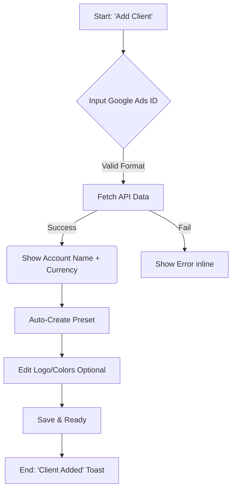
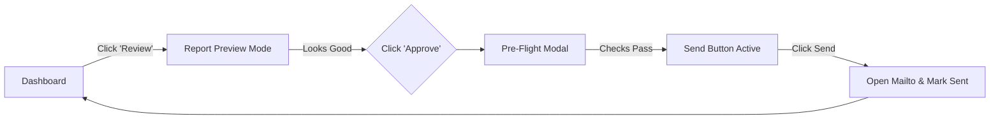

# UX Design Specification flipika

**Author:** Elou
**Date:** 2026-01-09

---

<!-- UX design content will be appended sequentially through collaborative workflow steps -->

## Executive Summary

### Project Vision
Flipika is a "Safety First" reporting platform for Media Buyers, designed to eliminate Monday morning stress. It replaces manual assembly of Google Ads reports with a robust "Preset" system and a mandatory "Pre-Flight Check" that guarantees zero errors. The goal is "Serenity" over "Flexibility", enforcing brand consistency and data accuracy through rigid binding and client-side validation.

### Target Users
**Primary Persona:** "Thomas, the Hurried Media Buyer".
*   **Role:** Agency account manager or freelancer handling multiple clients.
*   **Motivation:** speed and peace of mind. Wants to clear his to-do list efficiently.
*   **Pain Points:** Anxiety about sending wrong data/logos, repetitive manual formatting, "Monday morning dread".
*   **Tech Savvy:** Moderate to High (uses Google Ads daily), but appreciates "Low-Tech" robustness (PDF/Mailto) over complex dashboards.

### Key Design Challenges
*   **The "Pre-Flight" Experience:** Balancing the *friction* of a mandatory check (which slows you down) with the *value* of safety (which reassures you). It must feel like a helpful copilot, not a bureaucratic blocker.
*   **Abstracting Complexity:** The 1:1 binding between Google Ads IDs and Client Presets is complex logic that must feel effortless and "magic" to the user during setup.
*   **Latency Management:** Google Ads API is slow. The UX must maintain a "Premium" and snappy feel (Skeleton screens, optimistic UI) despite backend delays.
*   **Premium Trust:** The UI must convey extreme reliability and polish (Glassmorphism, high-end aesthetics) to justify the switch from manual processes.

### Design Opportunities
*   **"Zen" Workflow:** Creating a specific "Monday Morning Mode" or flow that gamifies or smooths the batch processing of reports.
*   **Visual Confirmation:** Using the "Pre-Flight" modal not just for data, but for visual gratification (previewing the beautiful report they are about to send).

## Core User Experience

### Defining Experience
The core loop is **"Review, Approve, Relax"**.
The user doesn't "build" reports; they "review" pre-built reports. The interaction model is inverted: Flipika does the work, the user validates the quality. The experience shifts from *Active Creation* (stressful) to *Passive Validation* (reassuring).

### Platform Strategy
*   **Primary Platform:** Desktop Web (Chrome).
*   **Context:** Office hours, professional workstation, often dual-screen (Flipika on one, Google Ads on the other).
*   **Device Constraints:** Heavy data tables and PDF previews require significant screen real estate. Mobile is secondary (read-only dashboard check).
*   **Offline:** Critical for "Pre-Flight" data fetching (must handle failures gracefully) but PWA offline support is a "Nice to Have" for checking historical sent reports.

### Effortless Interactions
*   **The "Magic" Setup:** Input a Google Ads Customer ID → Flipika automatically fetches account name/currency/logo from API. No manual typing.
*   **One-Click "Go":** From the dashboard, generating a report is one click. The "Pre-Flight" modal opens instantly.
*   **Email Handoff:** The transition from Flipika to the user's email client (via mailto) must be seamless. The draft is ready; they just hit "Send".

### Critical Success Moments
*   **The "Green Light":** The exact moment the Pre-Flight check passes. All KPIs are green, the logo is correct. Stress evaporates.
*   **The "Binding":** When a new client is successfully linked to Google Ads. It proves the system "works" and "knows" the client.
*   **The "Done" State:** Seeing the dashboard counter drop to zero ("0 reports needed"). The job is finished.

### Experience Principles
1.  **Safety Over Speed:** Never let the user skip a safety check. Friction is acceptable if it prevents an error.
2.  **Don't Make Me Think:** If the system knows the Customer ID, it should know the currency and timezone. Never ask for data we can fetch.

## Desired Emotional Response

### Primary Emotional Goals
*   **Serenity (The North Star):** The user should feel physically lighter. The knot in the stomach ("Did I make a mistake?") should be untied by the interface.
*   **Relief:** The primary emotion upon completing the task. "Thank god that's done, and I know it's right."
*   **Confidence:** A feeling of professional competence. "I am in control of my tools."

### Emotional Journey Mapping
1.  **Anticipation (Friday/Monday):** "I have to do reports." → *Shift to:* "It will only take 5 minutes with Flipika."
2.  **Engagement (During Setup):** "Is this going to work?" → *Shift to:* "Wow, it just found my client automatically. It's magic."
3.  **Pre-Flight (The Peak):** "Is the data right?" → *Shift to:* "Everything is green. The system has my back."
4.  **Completion (Sent):** "Did I forget anything?" → *Shift to:* "Task complete. Zero bandwidth used. I can go grab a coffee."

### Micro-Emotions
*   **Anxiety vs. Reassurance:** Every loading spinner must be reassuring (e.g., "Checking Google Ads data..." is better than "Loading...").
*   **Friction vs. Protection:** The Pre-Flight modal is "Protective Friction". Users should feel *protected* by it, not *blocked*.
*   **Pride:** The generated PDF should lock beautiful. The user takes credit for the "Professional Polish" provided by Flipika.

### Design Implications
*   **Color Psychology:** Use calming Blues (Trust, Tech) and Greens (Success, Go). Avoid aggressive Reds except for actual errors.
*   **Language:** Use affirming, declarative language ("Report Validated", "Ready to Send") rather than tentative language ("Check Report", "Send?").
*   **Feedback Loops:** Every action needs immediate, positive feedback. A "Click" should feel substantial. A "Save" should be physically satisfying (animation).

### Emotional Design Principles
*   **"We've Got This":** The interface takes responsibility. It guides, it suggests, it validates. It never leaves the user guessing.
*   **Quiet Confidence:** The design shouldn't shout. No clutter, no pop-ups, no up-sells during the workflow. Just the task at hand.

## UX Pattern Analysis & Inspiration

### Inspiring Products Analysis
1.  **Linear:** For its "speed-first" and "keyboard-first" interactions. It turns project management (usually a chore) into something snappy and precise.
2.  **Superhuman:** For the "Zen" inbox zero concept. It gamifies clearing a queue with satisfying micro-interactions and speed.
3.  **Stripe Dashboard:** For the "Safety & Trust" aesthetic. Clean data presentation and an aura of financial-grade reliability.

### Transferable UX Patterns
*   **The "Queue" Workflow (Superhuman):** Treat reports as an "Inbox" to be cleared. Use shortcuts (e.g., 'E' to Archive/Send) to cruise through the list.
*   **Optimistic UI (Linear):** When a user actions a report, hide it immediately. Don't wait for the server. Make the UI feel instant.
*   **Contextual Actions:** Show actions (Edit, Send) only on hover or when relevant, reducing visual clutter.

### Anti-Patterns to Avoid
*   **"The Wizard":** Long, multi-step wizards for generating a report. (Too slow).
*   **"The Cockpit":** Dashboards crowded with meaningless charts just to look "busy". (Flipika should be quiet).
*   **"The Spinner Jail":** Blocking the entire screen while loading one background element. (Data fetching should be non-blocking where possible).

### Design Inspiration Strategy
*   **Adopt:** The "Inbox Zero" mentality for the main dashboard (Empty state is the goal).

## Design System Foundation

### 1.1 Design System Choice
**Custom "Glass-Premium" System based on Tailwind CSS.**
We act as a "Themeable System" rather than a rigid library. We use Tailwind utilities to compose a bespoke, high-end look that feels like a native app.

### Rationale for Selection
*   **Aesthetics:** The "Glassmorphism" and "Dark Mode" requirements are easier to implement with custom Tailwind utility classes than fighting against Material UI or Ant Design defaults.
*   **Performance:** We only ship the CSS we use.
*   **Flexibility:** We need specific, dense data tables (for Google Ads reports) that standard libraries often handle poorly (too much padding).

### Implementation Approach
*   **Core:** Tailwind CSS v3+.
*   **Icons:** `lucide-react` (proven, clean, consistent).
*   **Components:** Headless UI or Radix UI (for accessibility) + Custom styling. We do *not* use a heavy component library (like MUI) to keep the bundle size small and the "Zen" feel snappy.
*   **Animation:** `framer-motion` for the "delight" micro-interactions (e.g., the Pre-Flight success tick).

### Customization Strategy
*   **Colors:** strict `slate` and `blue` palette defined in `tailwind.config.js`. No ad-hoc colors.
*   **Typography:** 'Inter' font family. Strong hierarchy using `tracking-tight` for headings to give that "modern SaaS" look.

## Core User Experience (Detailed Mechanics)

### 2.1 Defining Experience
**The Pre-Flight Check.**
It is a mandatory, modal-based gateway between "Draft" and "Sent". It forces the user to pause and validate key data points (Budget, Dates, Logos) before the email can leave the building.

### 2.2 User Mental Model
*   **Current Model:** "I have to open the PDF, check the date manually, check the sum manually, scroll to the bottom to check the logo, then attach it to an email, then write the email..."
*   **Flipika Model:** "I press 'Go'. Flipika shows me the summary. I click 'Verify'. It creates the email for me."
*   **Metaphor:** The "Pilot's Checklist". You don't take off until the board is green.

### 2.3 Success Criteria
*   **Speed:** The check must load in < 200ms (optimistic). Data verification in < 1s.
*   **Confidence:** The user must *see* the data being checked (ticks appearing).
*   **Friction:** It must be impossible to send without checking (Button disabled until checks pass).

### 2.4 Novel UX Patterns
*   **"Protective Blocking":** Deliberately stopping the user (Blocking the "Send" button) until they interact. This is usually an anti-pattern, but here it is the *core value proposition* (Safety).
*   **"Visual Receipt":** The modal doesn't just say "OK"; it shows a visual thumbnail of the generated PDF report *next* to the green ticks, visually proving the output matches the data.

### 2.5 Experience Mechanics
**1. Initiation:**
User clicks "Generate Report" on a dashboard card.
**2. Interaction:**
A Glassmorphic modal opens (Background blurs).
A checklist appears: "Fetching Data...", "Checking Budget...", "Validating Dates...".
**3. Feedback:**
As each check passes, a satisfying green tick animates.
If a check fails (e.g., "Budget mismatch"), it pulses Red and offers a "Fix" button.
**4. Completion:**

## Visual Design Foundation

### Color System
*   **Palette:** `Slate` (Neutral) + `Blue` (Action/Brand) + `Emerald` (Success) + `Rose` (Error/Destructive).
*   **Dark Mode First:** The design is optimized for Dark Mode using `slate-900` backgrounds and white text with varying opacity.
*   **Glassmorphism:**
    *   `bg-slate-900/50` + `backdrop-blur-xl` + `border-white/10` for panels.
    *   This creates the "Premium" depth without needing heavy drop shadows.

### Typography System
*   **Font Family:** Inter (Variable font).
*   **Hierarchy:**
    *   **H1:** `text-3xl font-bold tracking-tight text-white` (Page Titles).
    *   **H2:** `text-xl font-semibold tracking-tight text-white` (Section Headers).
    *   **Body:** `text-sm text-slate-400` (Secondary text / Labels).
    *   **Data:** `text-sm font-medium text-slate-200` (Table data).
*   **Rationale:** "Tracking tight" on headings gives that crisp, modern SaaS look. Reducing body size to `text-sm` (14px) allows for denser data tables without clutter.

### Spacing & Layout Foundation
*   **Base Unit:** 4px (Tailwind standard).
*   **Layout Density:** "Comfortably Dense".
    *   **Tables:** `px-4 py-2` (Compact but legible).
    *   **Cards:** `p-6` (Generous padding for "Zen" whitespace).
    *   **Gap:** Standard `gap-4` (16px) for grids.

### Accessibility Considerations
*   **Contrast:** Ensure `text-slate-400` on `slate-900` meets AA standards. Important text bumps to `text-slate-200`.

## Design Direction Decision

### Design Directions Explored
1.  **The "Analyst" Dash:** Dense grids, charts, sidebar navigation. (Rejected: Too busy/stressful).
2.  **The "Wizard" Flow:** Step-by-step full screen forms. (Rejected: Too slow for power users).
3.  **The "Zen" Dashboard (Chosen):** A unified "Inbox" view with a glass header, floating action buttons, and a focus on empty states.

### Chosen Direction
**"The Zen Pilot"**
*   **Layout:** Single-column central feed (max-width `prose-xl`) centered on the screen. No sidebar.
*   **Navigation:** Top bar with minimal links ("Dashboard", "Clients", "Settings").
*   **Action:** Primary action is contextual. If there are pending reports, the "Inbox" is the focus. If empty, a rewarding "All Caught Up" illustration dominates.

### Design Rationale
*   **Focus:** Removing the sidebar removes 20% of visual noise. The user is here to do one thing: Approve Reports.
*   **Speed:** A central list (like Linear or Gmail) allows for rapid keyboard navigation (Down, Down, Enter).
*   **Trust:** The "glass" overlay for the Pre-Flight modal creates a focal point that feels expensive and reliable.

### Implementation Approach
*   **Dashboard:** `grid` layout.
*   **Cards:** `bg-slate-800/50` + `backdrop-blur-md` + `border-white/5`.

## User Journey Flows

### Journey 1: "The Magic Link" (Onboarding)
**Goal:** Connect a Google Ads Account and bind it to a Client Preset in < 30 seconds.
**Optimistic Principle:** We assume the ID is correct and valid until proven otherwise.

### Journey 2: "The Zen Review" (Monthly Execution)
**Goal:** Review and send 5 reports in 2 minutes.
**Flow:** Navigate -> Review -> Pre-Flight -> Send.

### Journey Patterns
*   **"Peek & Go":** Use Modals for short interactions (Pre-Flight), full pages for long ones (Report Preview).
*   **"Optimistic Updates":** When clicking "Save" or "Send", update the UI immediately. Revert only if the API fails.
*   **"Keyboard Shortcuts":** `Cmd+Enter` to Confirm/Send in any modal. `Esc` to Close.

### Flow Optimization Principles
*   **Zero Dead Ends:** Every error state must have a "Fix it" button, not just an "OK" button.

## Component Strategy

### Design System Components (Standard Atoms)
We will standard headless UI patterns for:
*   **Forms:** Buttons, Inputs, Checkboxes (Styled with Glass/Slate theme), Selects.
*   **Feedback:** Toasts, Loading Spinners (Skeleton).
*   **Navigation:** Dropdowns, Tabs.

### Custom Components (Zen Molecules)
These are the signature components that define the "Flipika Experience":

**1. The Pre-Flight Modal**
*   **Purpose:** The central "Safety Gate" validation interface.
*   **Anatomy:** Full-screen glass overlay. Left side: Checklist (animated). Right side: PDF Preview (live generation). Sticky Footer: "Fix Issues" or "Send Report".
*   **States:** Loading (Scanning), Error (Pulsing Red), Success (All Green), Sent (Confetti/Success animation).

**2. The Client Card (Zen Mode)**
*   **Purpose:** The primary item in the Inbox queue.
*   **Anatomy:** Horizontal "Ticket" style. Left: Client Logo + Name. Middle: Status Badge + "Last Sent" date. Right: Contextual Action button (Start Review).
*   **Interaction:** Hover elevates the card (`scale-105`) and reveals the action button.

**3. The Empty State**
*   **Purpose:** The reward for finishing work.
*   **Anatomy:** Large illustration (Relaxed Astronaut/Pilot). Encouraging text: "All Quiet on the Front. Enjoy your Coffee."

### Component Implementation Strategy
*   **Compound Components:** Build `PreFlight.Root`, `PreFlight.Checklist`, `PreFlight.Preview` to manage the complex internal state of the modal.
*   **Tailwind Variants:** Use `cva` (Class Variance Authority) to manage the glassmorphism variants (`glass-panel`, `glass-button`, `glass-input`).

### Implementation Roadmap
1.  **Phase 1 (Core):** `GlassPane`, `ClientCard`, `PreFlightModal` (Basic Logic).
2.  **Phase 2 (Polish):** `PreFlight` animations, PDF Preview integration.

## UX Consistency Patterns

### Button Hierarchy
*   **Primary (Action):** `bg-blue-600` hover `bg-blue-500`. Used for "Save", "Send", "Confirm". Only one per view.
*   **Secondary (Safe):** `bg-slate-800` (Glass). Used for "Cancel", "Back", "Edit".
*   **Destructive (Danger):** `text-rose-400` (Ghost) or `bg-rose-900/50` (Glass). Used for "Disconnect", "Delete".
*   **Rule:** Buttons on Glass panels should have a subtle inner border (`border-white/10`) to maintain contrast against complex backgrounds.

### Feedback Patterns
*   **Success:** Do not use full-screen success pages. Use **Toasts** (Top Right) for background actions ("Saved"). Use **Micro-animation** (e.g. icon morph) for major milestones (Sent). *Note: No Confetti to maintain professional tone.*
*   **Error:** Inline errors for forms (under the input). Toast errors for API failures ("Google Ads unreachable").
*   **Loading:**
    *   **Skeleton:** For initial page load (Dashboard).
    *   **Spinner (Inside Button):** For submitting forms. Never block the UI unless absolutely necessary (Pre-Flight).

### Form Patterns
*   **Labels:** Top-aligned, `text-slate-400`.
*   **Inputs:** `bg-slate-900/50` (Darker than card). Focus ring `ring-2 ring-blue-500`.
*   **Validation:** specific "Valid" state (Green tick inside input) for positive reinforcement during setup (e.g., Valid Google Ads ID).

### Navigation Patterns
*   **Top Bar:** Global context (User, Workspace).
*   **Breadcrumbs:** Essential for deep navigation (Client -> Reports -> Specific Report).

## Responsive Design & Accessibility

### Responsive Strategy
*   **Desktop First:** The primary experience is on large screens (>1280px). The "Zen Dashboard" is centered but can expand to fill 4K monitors if needed.
*   **Mobile Companion:** Mobile (<768px) is **Read-Only**. Users can *view* "Sent" reports and *check* status, but the heavy "Pre-Flight Check" (simulating PDF generation) is disabling or simplified on mobile to avoid frustration.
*   **Tablet:** Treated as small desktops. The layout adapts (grid columns reduce from 3 to 2) but functionality remains 100%.

### Breakpoint Strategy
*   **Mobile:** `< 640px` (Stack columns, Hide "Action" buttons for complex tasks).
*   **Tablet:** `640px - 1024px` (2 Column Grid).
*   **Desktop:** `> 1024px` (Centered Container `max-w-5xl`, 3 Column Grid).

### Accessibility Strategy
*   **Level:** WCAG 2.1 AA (Corporate Requirement).
*   **Key Focus:**
    *   **Keyboard Navigation:** Since this is a "Zen Pilot" app, power users *must* be able to confirm checks using `Space` or `Enter`.
    *   **Contrast:** `slate-400` text on `slate-900` needs careful tuning. We will use `slate-300` for essential text to ensure > 4.5:1 contrast.
    *   **Reduced Motion:** The "Checkmark" animations must be instant if `prefers-reduced-motion` is active.

### Testing Strategy
*   **Automated:** `axe-core` in CI/CD pipeline.
*   **Manual:** "No Mouse" days. Developer must be able to complete a "Pre-Flight" using only the keyboard.

