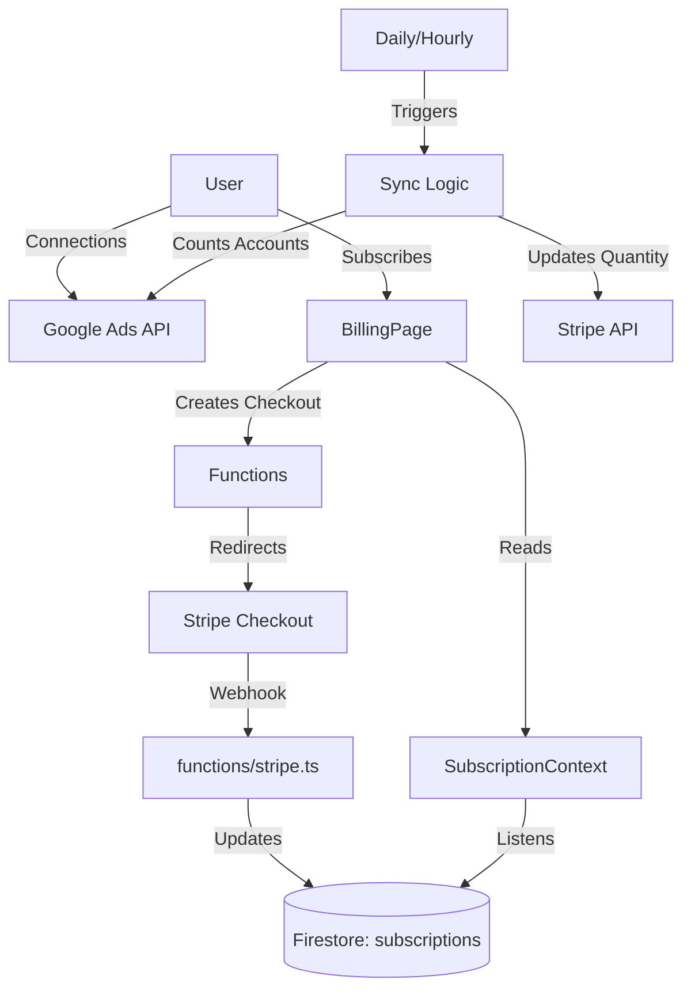

# Deep Dive: Billing & Subscription

## Overview
Flipika uses a per-seat pricing model where "seats" correspond to connected Google Ads accounts. The billing system is built on **Stripe** and is tightly integrated with the Google Ads OAuth flow to ensure accurate billing based on usage.

## Architecture & Data Flow

### Core Data Models
-   **Subscription**: stored in `subscriptions/{userId}`. Mirrors the Stripe subscription status and tracks usage.
-   **BillingEvent**: stored in `billingHistory`. An append-only log of all billing-related actions (syncs, payments, updates).
-   **User**: `users/{userId}` stores the `stripeCustomerId` and acts as the link between Firebase Auth and Stripe.

### Component Architecture

## Backend Services (`functions/src/stripe.ts`)

### 1. Billing Synchronization (`syncUserBilling`)
This is the critical logic that aligns Stripe billing with actual usage.
-   **Trigger**: Called manually via UI, or automatically during scheduled maintenance.
-   **Process**:
    1.  Fetches user's Google Ads OAuth tokens.
    2.  Queries Google Ads API for *active* child accounts (`status = 'ENABLED' AND manager = FALSE`).
    3.  Calculates `newQuantity = Math.max(1, activeAccountsCount)`.
    4.  Updates Stripe Subscription Item quantity if changed.
    5.  Updates Firestore `subscriptions` document.

### 2. Webhook Handling
Robust webhook handler supporting:
-   `checkout.session.completed`: Links new subscriptions to users.
-   `customer.subscription.updated`: Syncs status changes (e.g., past_due, active) and period dates.
-   `invoice.payment_succeeded/failed`: Logs payment history events.
-   `trial_will_end`: Logs upcoming trial expirations.

### 3. Session Management
-   `createCheckoutSession`: Initiates a new subscription with trial period.
-   `createCustomerPortalSession`: Generates a link to Stripe's self-serve portal for updating payment methods or canceling.

## Frontend Components

### 1. SubscriptionContext (`contexts/SubscriptionContext.tsx`)
Provides global access to subscription state.
-   **Real-time Updates**: Listens to `subscriptions/{userId}` in Firestore.
-   **Helpers**: `isActive`, `canAccess`, `isTrialing` derived state.

### 2. Billing Page (`pages/BillingPage.tsx`)
The user interface for billing management.
-   **Status Display**: Shows current plan, next billing date, and usage count.
-   **History**: Displays a timeline of billing events from `billingHistory`.
-   **Actions**: "Manage Subscription" (Stripe Portal) and "Sync Billing" (Manual trigger).

### 3. SubscriptionGuard
A wrapper component (implied) to protect routes or features based on `canAccessPaidFeatures` check.

## Key Features

### 1. Per-Seat Pricing with Minimum
The system charges per active Google Ads account but enforces a minimum of 1 seat, ensuring a base revenue floor even if no accounts are connected.

### 2. Automatic Proration
Stripe's `proration_behavior: 'create_prorations'` is used during syncs. If a user adds 5 accounts mid-month, they are charged a pro-rated amount immediately or on the next invoice, ensuring fair billing.

### 3. Trial Management
New subscriptions start with a 14-day trial. The system tracks `trialEndsAt` and handles trial expiration events via webhooks.

## Security & Reliability
-   **Webhooks**: Verified using Stripe signing secrets to prevent spoofing.
-   **Redundancy**: Billing state is stored in Firestore (`subscriptions`) as a cache of truth, allowing the app to function even if Stripe API is temporarily slow.
-   **History**: The `billingHistory` collection provides an audit trail for support inquiries.
