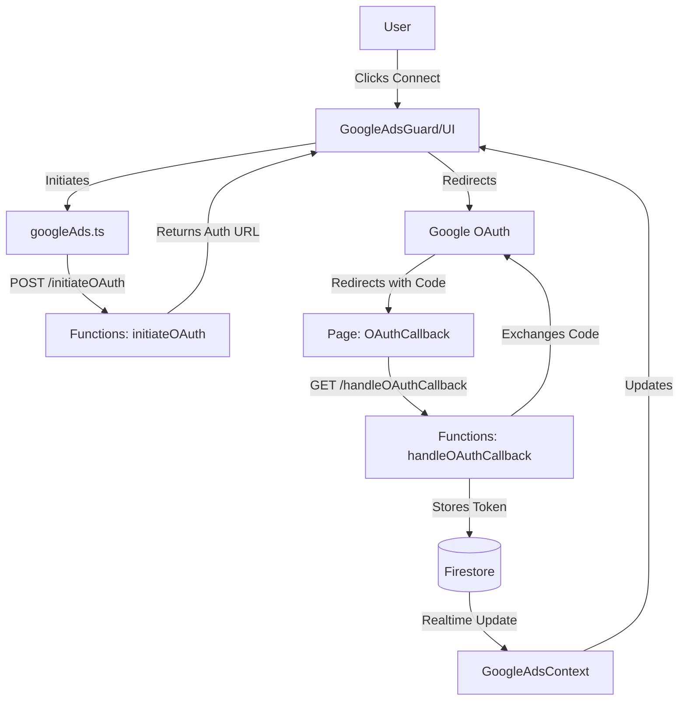

# Deep Dive: Google Ads Integration

## Overview
This document details the end-to-end integration of Google Ads within Flipika. It covers the full lifecycle from OAuth authentication and token management to data fetching and UI protection. The integration is designed to be secure, real-time reactive, and user-friendly.

## Architecture

The integration follows a split architecture:
-   **Frontend (React)**: Manages user state, connection status, and UI feedback.
-   **Backend (Firebase Functions)**: Handles sensitive OAuth exchanges, token storage, and direct API communication with Google.
-   **Database (Firestore)**: Acts as the state sync layer between backend and frontend.

### Data Flow Diagram


## Frontend Components

### 1. Connection Management (`GoogleAdsContext.tsx`)
The context acts as the centralized source of truth for the Google Ads connection state.
-   **Real-time Listeners**: It sets up `onSnapshot` listeners on:
    -   `users/{uid}/tokens/google_ads`: To determine `isConnected`.
    -   `users/{uid}/integrations/google_ads`: To retrieve the list of accessible accounts (`accounts`).
-   **Methods**:
    -   `syncAccounts()`: Triggers `/getAccessibleCustomers` to refresh the account list.
    -   `disconnect()`: Revokes tokens via API and cleans up local state.
    -   `setLinkedCustomerId(id)`: Updates the default selected account.

### 2. Service Layer (`services/googleAds.ts`)
A typed wrapper around the backend API Cloud Functions. All requests automatically include the Firebase ID token for authentication.
-   `initiateGoogleAdsOAuth()`
-   `fetchAccessibleCustomers()`
-   `fetchCampaigns(customerId)`
-   `fetchWidgetMetrics(...)`: Optimized aggregate fetch for dashboards.
-   `fetchAdCreatives(...)`: Fetches ad previews.

### 3. Authentication UI
-   **OAuthCallback (`pages/OAuthCallback.tsx`)**:
    -   Catches the `code` and `state` from the Google redirect.
    -    calls `/handleOAuthCallback`.
    -   Provides visual feedback (loading/success/error) before redirecting to the app.
-   **GoogleAdsGuard (`components/common/GoogleAdsGuard.tsx`)**:
    -   A wrapper component that protects routes or features requiring Google Ads.
    -   **Modes**:
        -   `block`: Replaces content with a full-screen empty state loop.
        -   `partial`: Shows an inline warning banner but allows access (soft gate).
    -   **Demo Mode**: Automatically bypasses the guard if `DemoModeContext` is active.

## Backend Implementation

### 1. OAuth Flow (`functions/src/oauth.ts`)
-   **Initiate**: Generates a secure authorization URL with a unique `state` stored in `oauth_states` collection to prevent CSRF.
-   **Callback**:
    1.  Validates `state` and expiration.
    2.  Exchanges `code` for `access_token` and `refresh_token`.
    3.  Stores `refresh_token` securely in `users/{uid}/tokens/google_ads`.
    4.  Triggers an initial account sync.

### 2. Data Access (`functions/src/index.ts`, `metrics.ts`)
All data access uses the stored `refresh_token`. The stored `access_token` is generally not used/trusted; the backend SDK handles token refreshing automatically using the refresh token.
-   **Security**: The Developer Token is kept in Secret Manager and never exposed to the client.
-   **Performance**: Large data aggregations (summing campaign metrics) are done server-side to minimize payload size sent to the frontend.

## Data Models

### Firestore Structure
```type
// users/{uid}/tokens/google_ads
interface TokenDoc {
  refresh_token: string;
  scopes: string[];
  created_at: Timestamp;
  updated_at: Timestamp;
}

// users/{uid}/integrations/google_ads
interface IntegrationsDoc {
  accounts: Array<{
    id: string; // Customer ID (e.g., 1234567890)
    name: string; // Descriptive name
  }>;
  lastSyncedAt: Timestamp;
}
```

## Security Considerations
1.  **Token Storage**: Refresh tokens are stored in a restricted subcollection (`tokens`) that is **not readable** by the frontend client SDK (enforced via Security Rules). Only the backend SDK has access.
2.  **State Parameter**: Used to prevent CSRF attacks during the OAuth dance.
3.  **Origin Validation**: The OAuth callback validates the origin to prevent open redirect vulnerabilities.
