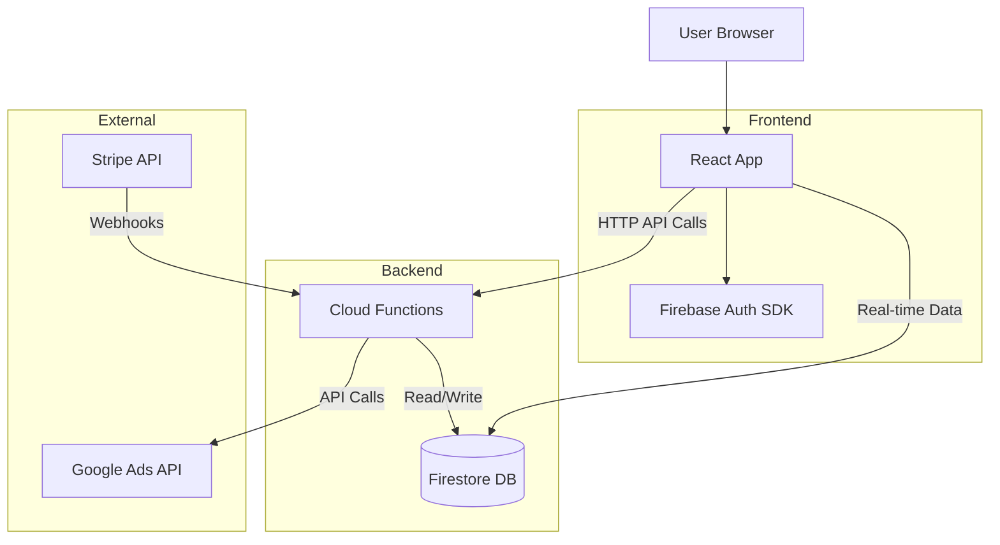

# Integration Architecture

> **Generated**: 2026-01-05

## Component Interaction

The application follows a **Frontend-Backend** architectural style with tight integration via Firebase services.

### 1. Web Frontend (React) ↔ Backend (Functions)

| Type | Direction | Description |
| :--- | :--- | :--- |
| **HTTP API** | Frontend → Backend | Direct calls to Cloud Functions for complex logic (e.g., specific Google Ads metrics, report generation trigger). |
| **OAuth** | Frontend ↔ Backend | `useGoogleAdsToken` hook redirects to Google, Backend handles callback at `/oauth/callback` and stores tokens in Firestore. |
| **Webhooks** | Stripe → Backend | Stripe webhooks hit `stripe` function to update subscription status in Firestore. |

### 2. Frontend ↔ Data Layer (Firestore)

| Type | Direction | Description |
| :--- | :--- | :--- |
| **Real-time Sync** | Frontend ↔ Firestore | The dashboard and lists use Firestore listeners to subscribe to data changes (e.g., `reports`, `subscriptions`). |
| **Direct Write** | Frontend → Firestore | Simple CRUD operations (creating a template, saving draft) are often performed directly from the client using Firebase SDK secure patterns. |

## Data Flow Diagram

## Shared Contracts

- **Types**: Shared TypeScript interfaces (likely copied or monorepo shared) ensure consistency for `Report`, `User`, `Template` objects.
